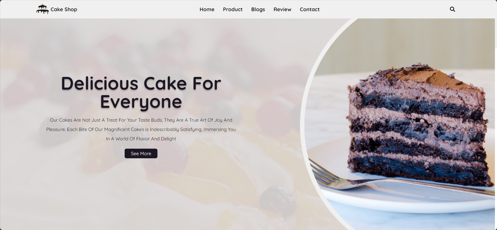

# Cake-Shop 🧁

The Cake Shop project is a delightful and visually appealing website template designed for a cake shop or bakery. It showcases an elegant and user-friendly interface to present the shop's products, blogs, client reviews, and contact information. The project utilizes HTML, CSS, and JavaScript, along with popular libraries like Swiper for a smooth and interactive user experience.

## Detailed Description

### HTML (index.html)

The HTML file sets up the structure of the website, including the header, various sections like home, product showcase, blogs, newsletter subscription, client reviews, and a footer with contact information and social media links. The site is designed to be responsive and user-friendly.

### CSS (style.css)

The CSS file provides styles for the entire website, ensuring a consistent and visually appealing layout. It defines colors, fonts, spacing, and responsiveness, creating a modern and attractive design. Media queries are used to adapt the layout for different screen sizes, enhancing the user experience across devices.

### JavaScript (index.js)

The JavaScript file adds interactivity to the website. It includes functionality for toggling the navigation menu and search bar on smaller screens. Additionally, it utilizes the Swiper library to create dynamic sliders for product showcases, blogs, and client reviews, enhancing the visual presentation of content.

## List of Technologies

- HTML
- CSS
- JavaScript
- Swiper Library
- Google Fonts

## Functionality

1. **Responsive Design:** The website is designed to be responsive, ensuring a seamless experience across various devices and screen sizes.
2. **Navigation:** The navigation bar allows users to easily navigate to different sections of the website.
3. **Product Showcase:** A visually appealing product showcase section with dynamic sliders using the Swiper library.
4. **Blogs:** Engaging blog section with informative content and links to external sources.
5. **Newsletter Subscription:** Users can subscribe to the newsletter for the latest updates.
6. **Client Reviews:** Display of client reviews in an interactive slider for a positive user experience.
7. **Contact Information:** Footer section with quick links and contact information.

## Preview

